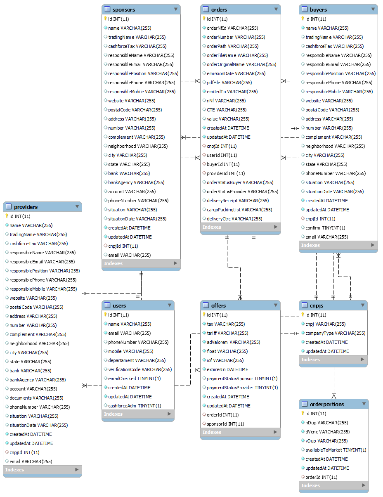

# Cashforce - tech assessment

### Projeto realizado como requisito de aprovação no teste técnico para a vaga de Desenvolvedor Fullstack na Cashforce ©

---

## Rodando a aplicação

> Com Docker
  - Na pasta raiz, rode a aplicação com o comando `docker-compose up -d --build`
    - Para rodar os testes do _**backend**_, acesse o terminal do serviço _app_backend_ dentro do Docker e use `npm test`

---

## Diagrama Entidade Relacionamento

<details>
  <summary>
    <strong> Diagrama </strong>
  </summary><br>



</details>


---

## Rotas

A rota padrão da aplicação lista todas as notas fiscais presentes no banco de dados.

- Listar notas fiscais: [GET `/`](back-end/src/routes/orderRouter.js)
  - Retorno: 
  ```json
  [
    {
      "notaFiscal": "18153",
      "sacado": "SACADO 001",
      "cedente": "CEDENTE 002",
      "emissao": "2020-10-30",
      "valor": "198450",
      "status": "0"
    },
    {
      "notaFiscal": "18157",
      "sacado": "SACADO 001",
      "cedente": "CEDENTE 002",
      "emissao": "2020-11-04",
      "valor": "168850",
      "status": "0"
    },
    {
      "notaFiscal": "18184",
      "sacado": "SACADO 001",
      "cedente": "CEDENTE 002",
      "emissao": "2020-11-10",
      "valor": "222795",
      "status": "7"
    }
  ]
  ```
  